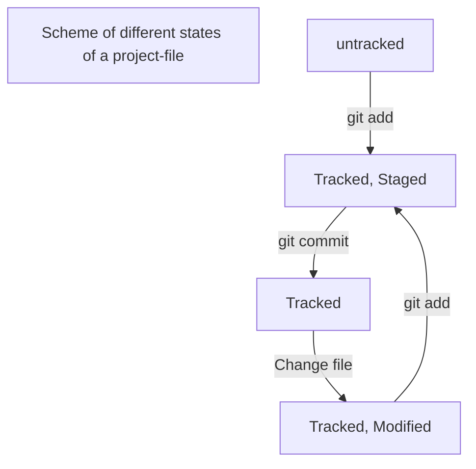

#### Mermaid scheme

## Example

```mermaid
%% Это пример, как должна выглядеть схема
flowchart TD;
	start[Scheme of different states of a project-file]
	A[untracked] -- git add --> B[Tracked, Staged];
	B -- git commit --> C[Tracked];
	C -- Change file --> D[Tracked, Modified];
	D -- git add --> B;

```
